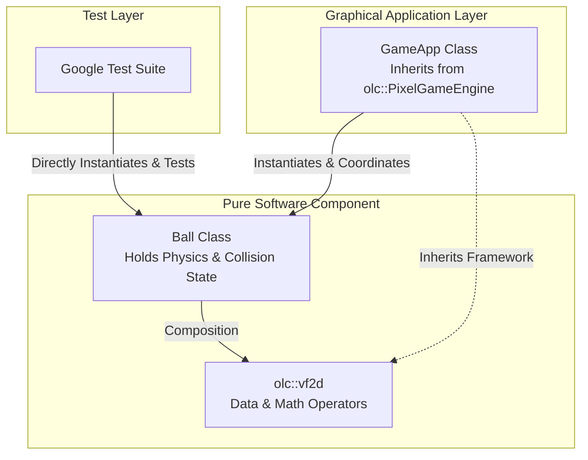
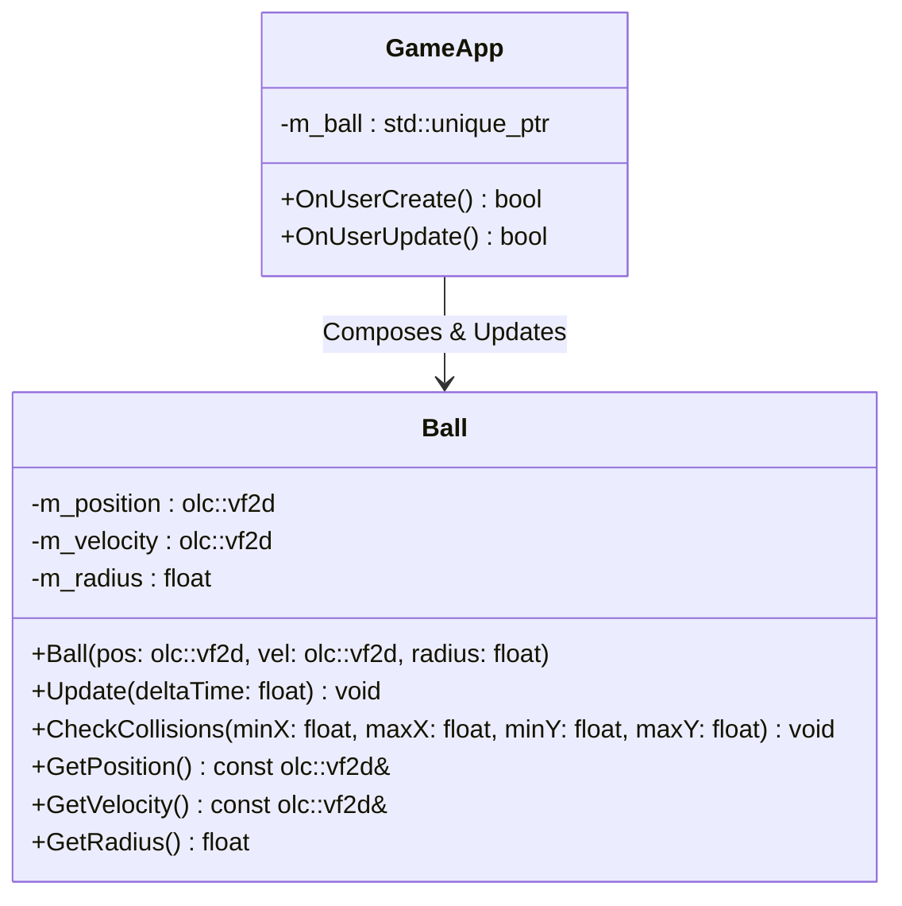

# Software Architecture

---

# Software Component Architecture

This document defines the structural boundaries, data composition, and runtime relationships for the Bouncing Ball component.

## 1. Component Block Diagram
This diagram shows how the system layers are separated. The physics engine logic relies only on the abstract data structures from `olc`, keeping it fully testable outside of an active application window.

## 2. Component Class Diagram
By using `olc::vf2d` (which is a type alias for `olc::v2d_generic<float>`), we utilize pre-existing vector arithmetic while keeping our classes completely decoupled from rendering logic.

---

# Interfaces

---

